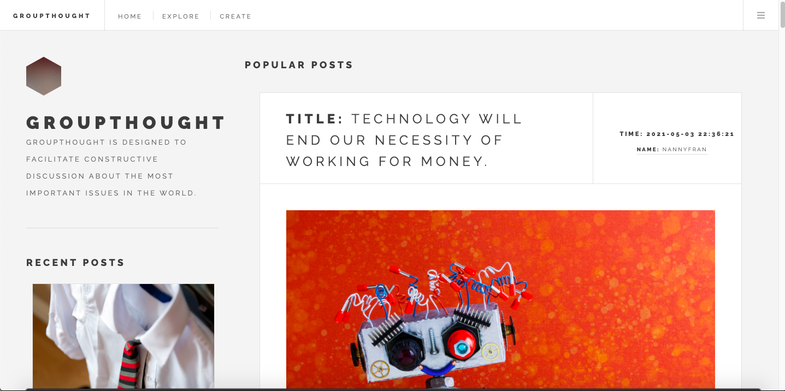

## FullStack App  GroupThought

Created a full stack application to engage in thoughtful discussion, understand different perspectives and help with collaborative decision-making. Users will be able to create accounts by signing up using their email. Users will be able to post discussion posts that contain a brief title describing your thesis. Users will be able to engage in these discussions by  provide arguments that support or don’t support the topic at hand.

[Checkout my live app](https://groupthought.herokuapp.com/)

## How It's Made:

## Tech used:

--HTML, CSS, JavaScript, Express, Node.js, MongoDB

## Lessons Leanred:

--I learned how to use Express and Node.js to get my app running server side and to create use authentication. I also learned how to create a database using MondoDB and with that, I was able to practice using CRUD and rest api's.

##Examples:

--Take a look at these couple examples that I have in my own portfolio:
[Checkout my portfolio to see live app](https://rodasghidei.netlify.app/)

## Other Projects
[To-Do-List - Express](https://personalexpressflowers.herokuapp.com/)
[Show-Off-Your-Style - FullStackLogin](https://show-your-style.herokuapp.com/)
[Bloom-Cafe - FullStackLogin](https://bloom-cafe.herokuapp.com/)
[Roulette-Fun - FullStackLogin](https://bloom-cafe.herokuapp.com/)

## Installation

1. Clone repo
2. run `npm install`

## Usage

1. run `npm run savage`
2. Navigate to `localhost:3000`
